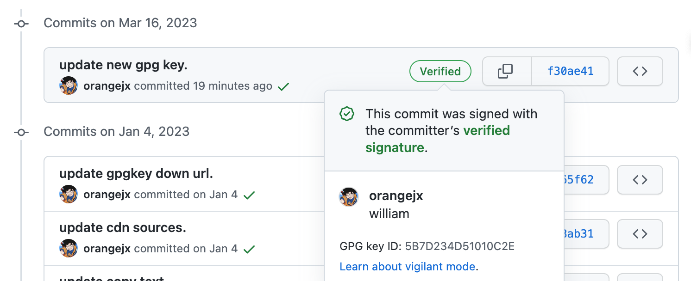
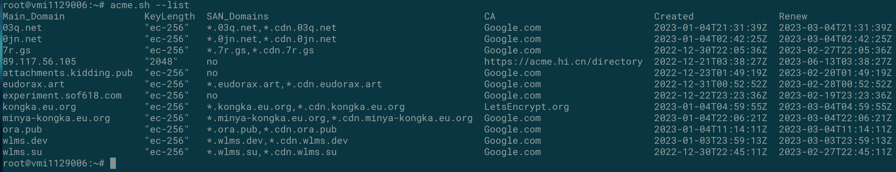
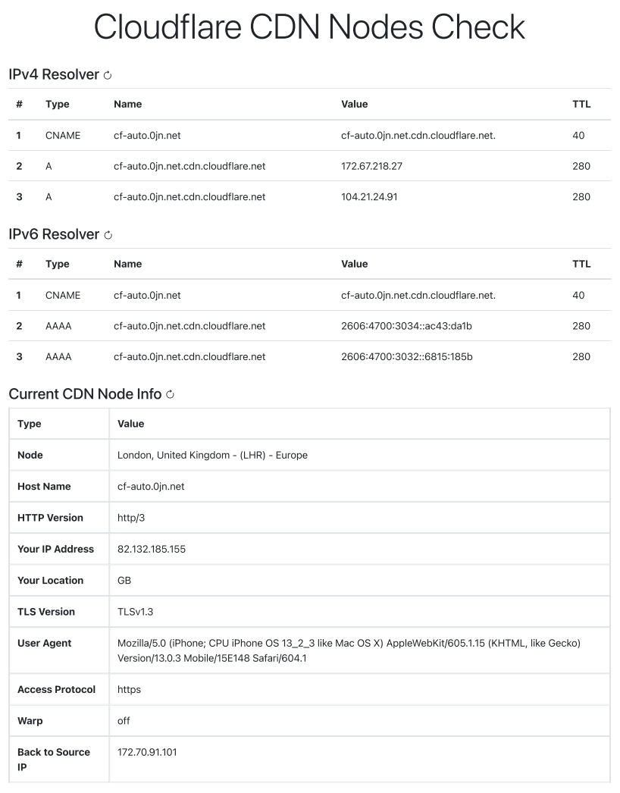
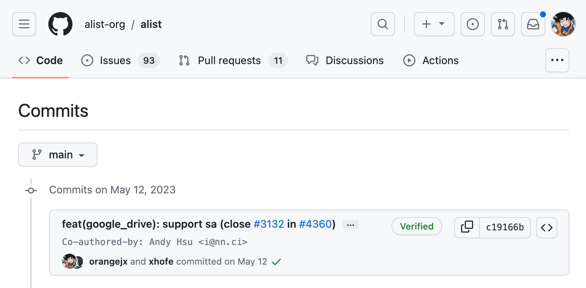

# **Aldrich** J. Xing

<!--
include contact information from the front matter
Supported arguments:
    - homepage: url, text
    - phone
    - email
-->



## Personal Statement
I have been learning software development since secondary vocational school, and I have participated in many web development competitions in Shanghai from 2014 to 2015 As well as the website development project in the Shanghai Division of the World Skills Competition China Selection Competition, and I also participated in the third prize of the National Skills Competition (Advanced Professional Group) Network Security Project from 2018 to 2019, so my learning ability is very strong. The main language I am good at is PHP and Python, and as long as the frameworks I use are ThinkPHP, Laravel, and Django, it means that I can learn other frameworks in a very short time because the logic of all programming languages ​​is interlinked. The languages used in the website development projects participating in the Shanghai Starlight Project Competition and the World Skills Competition are PHP, HTML5, CSS3, JavaScript, and jQuery, Bootstrap, so although I rarely use nodejs, because nodejs is also developed using JavaScript coding, so it is very easy for me to get started. And I built my own WordPress, mariadb, and bitwarden applications through docker, and I will use some simple SQL statements because most of the frameworks already include database management plugins, so I prefer to use the results that others have already done. I believe that your decision to hire me as your employee will not be regretted. At the same time, although I do not live in your city, I am willing to move for this, because I believe a good work item is enough to entice me to do it.

## Education
### **University of Sunderland** `Sep 2023`

```
Sunderland, UK
```
- MSc Data Science

### **Shanghai Technical Institute of Electronics & Information** `Jul 2020`

```
Shanghai, CN
```
- Information Security & Management

### **Shanghai Information Technology College** (Secondary School) `Jul 2017`

```
Shanghai, CN
```
- Software Development & Service

## Experience
### **Shanghai Jiujing Culture Dissemination Co., Ltd.** `Apr 2019 ~ Jan 2020`

_PHP & Front-End(HTML5, CSS3 & JavaScript) Developer_<br>

### **Shanghai Jimeng Logistics Co., Ltd.** `Apr 2020 ~ Jun 2022`

_System Operation & Maintenance_<br>

## Honors & Awards
### **Shanghai Technical Institute of Electronics & Information (STIEI)**
  - The **3rd** prize of the National Vocational College Skills Competition (NVCSC, China) Information Security Management and Evaluation Competition
  - The **3rd** prize of the 2018 "Cage Cup" National College Student Network Security Invitational Competition (NSIC-NCS, China)
  - The **1st** place Network Security Competition in University
  - **Technical Director** of Information Security Studio in University

### **Shanghai Information Technology College (SITC)**
  - **2nd** Prize of Shanghai Scholarship
  - **Merit Student** of Shanghai
  - **Outstanding Student Cadres** of SITC
  - **Vice President** of Student Union of Computer Department of SITC
  - **Merit Student** of SITC
  - **2nd Class Scholarship** of SITC
  - **Excellent Graduate** of SITC
  - To **ROC ZADKINE COLLEGE** for Exchange & Study
  - GPA: **3.4** / **4.0** (**top 5%** of majors)

## Skills
  - PHP & MySQL (MariaDB / SQLite)
    - [Laravel](https://laravel.com "Laravel.com")
    - [ThinkPHP](https://www.thinkphp.cn "www.ThinkPHP.cn")
    - [Composer](https://getcomposer.org "Composer")
  - HTML5, CSS3 & JavaScript
    - [jQuery](https://jquery.com "jQuery")
    - [Vue.js](https://vuejs.org "Vue.js")
    - [Bootstrap](https://getbootstrap.com "Bootstrap")
  - Python
    - [Django](https://www.djangoproject.com "Django")
  - Git
    - Personal Github Page: [@orangejx](https://github.com/orangejx)
  - Security
    - CSRF
    - XSS
    - Brute Force
    - File Include/Upload
    - SQL Inject
    - GPG key
      - [aldrichx@wlms.dev (E97F 0499 8EBF AFC4 AFE3 8B8E 259E 2222 2222 2222)](https://keyserver.ubuntu.com/pks/lookup?search=0x259e222222222222&fingerprint=on&op=index)
      - [\[1\]sign commit with gpg key](#1sign-commit-with-gpg-key)
  - acme.sh
    - [\[2\]photo](#2acmesh)
  - Markdown
    - Basic Markdown syntax
    - In fact, this [CV](https://about.wlms.dev "about.wlms.dev") & [ora.pub](https://www.ora.pub "www.ora.pub") is also done in Markdown.
  - Docker
    - Docker Command
    - Docker Compose
    - some Running Project:
      - bitWarden (A password online management software)
        - [https://bw.ora.pub](https://bw.ora.pub)
      - MariaDB (MariaDB Server is a high performing open source relational database, forked from MySQL.)
      - PHPMyAdmin (A web interface for MySQL and MariaDB.)
        - [https://pma.wlms.dev](https://pma.wlms.dev)
      - Docker Registry (The Docker Registry 2.0 implementation for storing and distributing Docker images)
        - [https://www.minya-kongka.eu.org](https://www.minya-kongka.eu.org/v2/_catalog)
        - [https://minya-kongka.eu.org](https://minya-kongka.eu.org/v2/_catalog)

## Contributed 
  - alist-org/alist
    - add driver of google drive by SA.
    - [\[4\]PR(Pull Request) Record](#4alist-google-drive-driver)

## Project
  - Cloudflare CDN Nodes Check
    - [https://cf-auto.0jn.net/en.html](https://cf-auto.0jn.net/en.html)
    - [Github Repository](https://github.com/orangejx/cf-auto-web.git)
    - [\[3\]Project Screenshot](#3cloudflare-cdn-node-check)
  - A consumables management system, demo.
    - [https://xjx.ora.pub](https://xjx.ora.pub)
    - username: admin
    - password: admin
  - A MBTI Test System 
    - [https://mbti.wlms.dev](mbti.wlms.dev)
    - username/phone number: 13800138000, or any start with `13|15|16|17|18|19` 11 length phone number
    - password: 123456, any `6` length number
---

## Appendix
### [1].sign commit with gpg key


### [2].acme.sh


### [3].Cloudflare CDN Node Check


### [4].alist google drive driver 


<!-- ### Footer

Last updated: May 2013 -->
